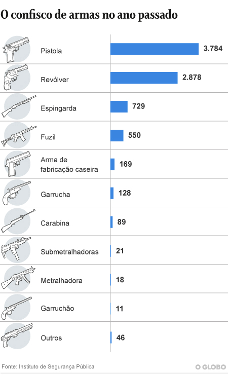

RStats 2021 Homework - Weapons
================
Victor Xavier
23/09/2021

## Introduction

University of Tartu - Institute of Technology

Reproducible Data Analysis in R - LOTI.02.015

Homework assignment - Bad graphs and data visualization

As main tool of learning, it was assigned to students search for a
published poorly designed graph, understand more about data
visualization and write reproducible code in R to improve that bad
graph. First of all it was required that students should be able notice
what bad data visualization is what it could cause to data analysis.
Errors in axis units, bad proportions, lack of crucial information were
amongst the examples shown to students.

After that it was learnt how to generate and customize plots with
tidyverse library. Explore data, understand and explore data to drawn
accurate conclusions. Finally data analysis was made using same data as
original published graph. Code was written in R synchronized to GitHub
to be made available anywhere and reproducibility tested.New data
visualizations was generated and results are registered into a report
containing main conclusions, source code and source data.

On this work, data choosen was the number of weapons seized by military
police in the state of Rio de Janeiro - Brazil. Original graph was
published in a news outlet regarding rise of siezed weapons. Original
source can be found at below link, in portuguese. Also original source
can be found on second link, also in portuguese.

<https://oglobo.globo.com/rio/armas-apreendidas-no-rio-em-2019-somam-mais-de-23-milhoes-veja-numeros-24806138>

<http://www.ispvisualizacao.rj.gov.br/Armas.html>

## Discussion

### Data Graph Analysis

Original graph can be found as image below. Extracted from above
mentioned source at 20.09.2021 14:42



The graph is reasonable enough to convey the amount of weapons seized by
weapon type.However not much else can be interpreted from it. The
article has more information, but it is harder to understand what could
more simply be done with visuals. In the article you can find how much
all these weapons would cost, considering average cost for each. However
no total sum is displayed.

The article claims that there was a increase in total arms seized
considering multiple years, but no historical data is displayed, even
though it is available at data source. It is also mentioned that
geographical data about weapons is available, although it wasn’t
presented neither found at data source. There is available data about
bladed weapons and explosives, but they were no included in graph.

Following improvements can be made to create a better graph:

    *Add explosives, bladed and simulated weapons information
    *Add data from multiple years
    *Compare total weapons or weapond type over the years
    *Add ammunition information

\#\#\#Building the graphs

Using tidyverse, and data table library, the graph will be constructed
by ggplot. The source data was in .xlsx, however file was too big for R
to handle. Solution was to convert into separate .csv files outside of
R, import and clean all of them so one could add everything to a single
data frame.

Data frame cleaning involved translating all terms to english,
correcting acronyms interpretation, correcting column order for data
frame consistency, pivoting columns into rows and making columns names
into row factors. This last operation was necessary to simplify data
frame subletting, since now weapon type is just a factor and not
multiple rows. Adding everything to a single data frame was made to
avoid errors in referencing each weapon type in the future. Both
“bladed” and ammo data was not differentiated, so total column was used
as amount to match other data frame type. Ammo will be treated
differently and won’t be added to other data frames not to mix
ammunition with weapon.

``` r
library(tidyverse)
```

    ## -- Attaching packages --------------------------------------- tidyverse 1.3.1 --

    ## v ggplot2 3.3.5     v purrr   0.3.4
    ## v tibble  3.1.4     v dplyr   1.0.7
    ## v tidyr   1.1.3     v stringr 1.4.0
    ## v readr   2.0.1     v forcats 0.5.1

    ## -- Conflicts ------------------------------------------ tidyverse_conflicts() --
    ## x dplyr::filter() masks stats::filter()
    ## x dplyr::lag()    masks stats::lag()

``` r
library(data.table)
```

    ## 
    ## Attaching package: 'data.table'

    ## The following objects are masked from 'package:dplyr':
    ## 
    ##     between, first, last

    ## The following object is masked from 'package:purrr':
    ## 
    ##     transpose

``` r
fire <- read.csv("data_fire.csv")
fire[17] <- NULL #discarding previuos total amount and addin type_2 notation
setnames(fire, old = c("ï..cisp", #translating every name to english by changing column names.
                       "mes",
                       "ano",
                       "aisp",
                       "risp",
                       "arma_fabricacao_caseira",
                       "carabina",
                       "espingarda",
                       "fuzil",
                       "garrucha",
                       "garruchao",
                       "metralhadora",
                       "outros",
                       "pistola",
                       "revolver",
                       "submetralhadora"),
               new = c("region_3",
                       "month", 
                       "year", 
                       "region_2", 
                       "region_1",
                       "homemande_gun",
                       "carabine",
                       "shotgun",
                       "rifle",
                       "derringer",
                       "long_derringer",
                       "machine_gun",
                       "others",
                       "pistol",
                       "revolver",
                       "submachine_gun"))
fire <- fire %>%
  pivot_longer( #transforming columns into factors, making data.frame longer.
    cols = 6:16, 
    names_to = "type_2",
    values_to = "amount")
fire$type_1 <- "firearm"
fire <- fire[ , c(1, 2, 3, 4, 5, 8, 6, 7)]
fire[sapply(fire, is.character)] <- lapply(fire[sapply(fire, is.character)], as.factor)
```

``` r
ggplot() +
  geom_col(data = filter(fire, year == "2019"),
           mapping = aes(x = reorder(type_2, amount), y = amount)) +
  coord_flip() +
  labs(title = "Total firearms seized on 2019",
       x = "Number of Weapons",
       y = "Type") +
  theme(plot.title = element_text(hjust = 0.5))
```

<!-- -->

Now the graph is replicate within R. Next code is to improve it by
adding other threatening objects, such as explosves, bladed weapons and
simulated weapons. Also a bar that representes the entire sum of weapons
aprehended.

``` r
blade <- read.csv("data_blade.csv")
setnames(blade, old = c("ï..cisp", #translating every name to english by changing column names.
                        "mes",
                        "ano",
                        "aisp",
                        "risp",
                        "total"),
                new = c("region_3",
                        "month", 
                        "year", 
                        "region_2", 
                        "region_1",
                        "amount"))

blade$type_1 = as.factor("bladed")
blade$type_2 = as.factor("bladed") #adding type_1 and type_2 column to data frame as vectors
blade <- blade[ , c(1, 2, 3, 4, 5, 7, 8, 6)] # changing column order from original data.set to fit convention


explosive <- read.csv("data_explosive.csv")
explosive[14] <- NULL #discarding previuos total amount
explosive <- explosive %>%
  pivot_longer( #pivoting columns into rows to make rows into factors and therefore make data.frame longer
    cols = 6:13, 
    names_to = "type_2", #name of new factor
    values_to = "amount") #values of such cells will correspond to this argument
explosive[6] <- as.factor("explosive")
explosive[8] <- as.factor("explosive") #adding type_1 and type_2 column to data frame as vectors
explosive <- explosive[ , c(1, 2, 3, 4, 5, 8, 6, 7)]
setnames(explosive, old = c("ï..cisp", #translating every name to english by changing column names.
                            "mes",
                            "ano",
                            "aisp",
                            "risp",
                            "...8"),
                    new = c("region_3",
                            "month", 
                            "year", 
                            "region_2", 
                            "region_1",
                            "type_1"))

simul <- read.csv("data_simul.csv")
simul[19] <- NULL #discarding previous total amount
simul <- simul %>%
  pivot_longer( #pivoting columns into rows to make rows into factors and therefore make data.frame longer
    cols = 6:18, 
    names_to = "type_2", #name of new factor
    values_to = "amount") #values of such cells will correspond to this argument
simul[6] <- as.factor("simulated") 
simul[8] <- as.factor("simulated") #adding type_1 and type_2 column to data frame as vectors
simul <- simul[ , c(1, 2, 3, 4, 5, 8, 6, 7)]
setnames(simul, old = c("ï..cisp", #translating every name to english by changing column names.
                       "mes",
                       "ano",
                       "aisp",
                       "risp",
                       "...8"),
               new = c("region_3",
                       "month", 
                       "year", 
                       "region_2", 
                       "region_1",
                       "type_1"))

weapons <- rbind(fire, explosive, blade, simul)
```

It is necessary to create a new data frame on which the total amount of
each type\_2 is present in a vector.

``` r
year_2019_g <- c(unique(fire$type_2),
               unique(blade$type_2),
               unique(explosive$type_2),
               unique(simul$type_2))
#create vector with type_2 names
year_2019_s <- c(sum(subset(fire, year == "2019" & type_2 == "homemande_gun" , select = amount)),
                 sum(subset(fire, year == "2019" & type_2 == "carabine" , select = amount)),
                 sum(subset(fire, year == "2019" & type_2 == "shotgun" , select = amount)),
                 sum(subset(fire, year == "2019" & type_2 == "rifle" , select = amount)),
                 sum(subset(fire, year == "2019" & type_2 == "derringer" , select = amount)),
                 sum(subset(fire, year == "2019" & type_2 == "long_derringer" , select = amount)),
                 sum(subset(fire, year == "2019" & type_2 == "machine_gun" , select = amount)),
                 sum(subset(fire, year == "2019" & type_2 == "others" , select = amount)),
                 sum(subset(fire, year == "2019" & type_2 == "pistol" , select = amount)),
                 sum(subset(fire, year == "2019" & type_2 == "revolver" , select = amount)),
                 sum(subset(fire, year == "2019" & type_2 == "submachine_gun" , select = amount)),
                 sum(subset(blade, year == "2019" & type_2 == "bladed" , select = amount)),
                 sum(subset(explosive, year == "2019" & type_2 == "explosive" , select = amount)),
                 sum(subset(simul, year == "2019" & type_2 == "simulated" , select = amount)))
#create a vector with 2019 type_2 total amounts
year_2019 <- data.frame (year_2019_g, year_2019_s)
#create 2019 year total amounts
setnames(year_2019, old = c("year_2019_g",
                            "year_2019_s"),
                    new = c("type_2",
                            "total"))
#change columns name on such data frame
setorder(year_2019, cols = "total")
#change data frame order to bigger amount to smaller
weapons$type_2 <- factor(weapons$type_2, levels = year_2019$type_2)
```

``` r
ggplot() + #generatin graph, using factor order applied on last chunk
  geom_col(data = filter(weapons, year == "2019"), mapping = aes(y = type_2, x = amount)) +
  labs(title = "Threatening objects seized on 2019",
       x = "Number of weapons",
       y = "Type")
```

<!-- -->

With this graph is easy to see that bladed, explosive and simulated
weapons correspond to a important number of objects seized. This shifts
the notion that rifles are primarily means of displaying firepower,
while explosives and simulated are just as important. However, it is
important to note that data alone is not sufficient to infer proper
results. It is possible that during operations the most valuable
weapons, rifles, machine guns and submachine guns, are smuggled away
from police action. This could result in fewer of these powerful weapons
being seized. Another historical fact is that even after apprehension,
these weapons are deviated from police control back to militia and drug
dealers. More data and careful analysis of operations is necessary do
dram definitive conclusion.

\#\#New graphs

With data already cleaned it is possible to create new graphs and
observe tendency of apprehensions through the years. It was used ggplot
on whole data frame comparing overall type(tyep\_1) and amount. Object
type was added to fill in order to understand distribution of types.

``` r
ggplot(data = weapons, mapping = aes(x = year, y = amount, fill = type_1)) +
  geom_col() +
  labs(title = "Objects seized by Police 2007 ~ 2021",
       y = "Number of Threatening objects",
       x = "Year",
       fill = "Type") +
  coord_flip() +
  scale_x_reverse()#flip it to side and then invert old x axis to make from smaller to bigger
```

<!-- -->

It was possible to make interesting observations with this new graph.
*2016 had the biggest number of seized weapons. This is maybe related to
2016 summer Olympics being held in Rio de Janeiro city that year. There
were more police operations than usual, brazil’s military armed forces
were involved in the security. Also UPP project was at it’s peak. This
also could have helped increase the number of 2016 year *From 2018 to
2019 there was in fact a increase in number of seized weapons, so the
article was in fact correct in stating that. However without this graph
one would have to trust the news outlet analysis. \*There was a change
in classification of objects in the year of 2014. Clearly shown by the
appearance of multiple different objects in that year. More data is
necessary to understand how that change was made and how those objects
were account in the years prior to this.

It is possible to do same yearly analysis with ammunition seized.

``` r
ammo <- read.csv("data_ammo.csv")
setnames(ammo, old = c("ï..cisp", #translating every name to english by changing column names.
                        "mes",
                        "ano",
                        "aisp",
                        "risp",
                        "total"),
                new = c("region_3",
                        "month", 
                        "year", 
                        "region_2", 
                        "region_1",
                        "amount"))

ammo$type_1 = as.factor("ammo") #adding weapon type do ammo data.frame
ammo <- ammo[ , c(1, 2, 3, 4, 5, 7, 6)] # changing column order from original data.set to fit convention

ggplot(data = ammo, mapping = aes(x = year, y = amount)) +
  geom_col() +
  labs(title = "Ammunition seized by Police 2014 ~ 2021",
       y = "Amount of ammo",
       x = "Year")+
  coord_flip() + scale_x_reverse()
```

<!-- -->

The scale of ammo captures is much higher than of other objects, over
hundreds of thousands. It does not follow the same patterns as objects.
Unfortunately no data before 2014 was available, probably with the
change in classification that was theorized before. More information is
necessary to draw conclusions.

\#Conclusion

It was possible to have a better understanding of the situation in Rio
de Janeiro state. By adding explosives, bladed and simulated weapons,
one can easily see that these objects account for 3rd, 4th and 5th
places in the year of 2019. To convey the message that only firearms are
captured is a failed view. In fact handguns are most prominent, however
other types are more popular than thought. It was possible to make
interesting observations with data from multiple years. More careful
data analysis is necessary do draw further conclusions. It is possible
to also make geographical distribution of this data set, however this is
out of the scope of this assignment.
